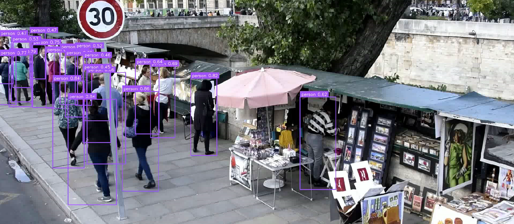
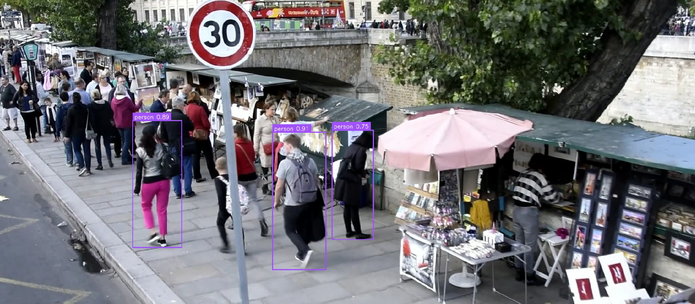
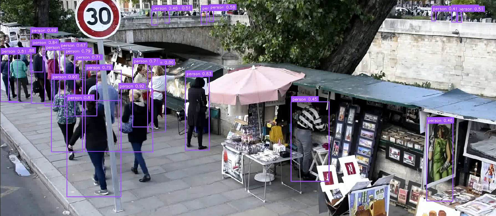
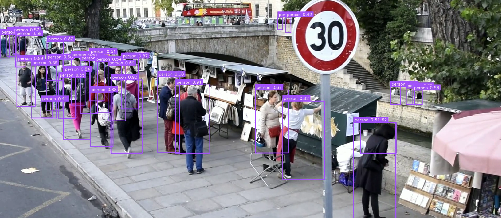

# Сrowd detection
## Описание проекта
### Fine-tuning
Для задачи детекции была выбрана модель YOLO11. Также данная модель была дообучена на датасете [CrowdHuman-with-YoloLabels](https://www.kaggle.com/datasets/haminhtien99/crowdhuman-with-yololabels).  

Полученные при обучении веса сохранены в `weights/best.pt` и используются основным приложением. Ноутбук `training/train_on_colab.ipynb` адаптирован для Google Colab и служит документацией дообучения, для работы основного приложения он необязателен.  

### Чтение видео
Реализовано асинхронное чтение видео с использованием многопоточности (`src/video_io.py`).  
Такой подход повышает общий FPS обработки, так как распараллеливает операции декодирования видео и инференса модели.

### Алгоритм ByteTrack
При детекции людей на видео возникает следующая проблема. Если человека временно перекрывает другой объект, то рамка (бокс) этого человека "мерцает", то есть временно пропадает.  

Для решения этой проблемы использован алгоритм [ByteTrack](https://arxiv.org/abs/2110.06864) (`src/tracker.py`). Он не отбрасывает детекции с низкой уверенностью, а использует их для восстановления траекторий.

### Детекция 
`src/detector.py` содержит инференс модели.  

В нем также реализован опциональный режим SAHI (Slicing Aided Hyper Inference). Кадр разрезается на фрагменты (640x640) перед подачей в нейросеть, что улучшает детектирование маленьких объектов, но может привести к дублированию рамок для одного и того же объекта.

## Установка
Проект протестирован на Python 3.10.10
1. Клонируйте репозиторий:
```
git clone https://github.com/Uliana0202/crowd_detection.git
cd crowd_detection
```
2. Установите зависимости:
```
pip install -r requirements.txt
```
## Запуск
Перед запуском поместите исходный файл crowd.mp4 в папку media/

### Стандартный режим (Рекомендуемый)
```
python main.py
```
### Режим SAHI
```
python main.py --sahi
```
### Расширенные настройки
```
python main.py --source media/crowd.mp4 --weights weights/best.pt --output output.mp4 --sahi
```
Описание аргументов:
| Аргумент | Описание | Значение по умолчанию |
| :--- | :--- | :--- |
| `--source` | Путь к входному видео | `media/crowd.mp4` |
| `--weights` | Путь к весам модели (`.pt`) | `weights/best.pt` |
| `--output` | Путь для сохранения результата | `output.mp4` |
| `--sahi` | Флаг для включения режима нарезки кадров (SAHI) | Отключено (False) |

## Выводы  
### Анализ fine-tuning
При дообучение было получено:
1. mAP50: 0.812
2. mAP50-95: 0.510 
3. Precision: 0.844
4. Recall: 0.704
Что в целом хорошо для 10 эпох обучения. Можно пробовать дообучать дальше.

### Сравнение стандарного инференса и режима SAHI
Стандартный режим:  
Плюсы: работает быстрее, отсутствуют дубликаты.  
Минусы: более низкая уверенность детекции, мелкие объекты пропускаются.




Режим SAHI:   
[Видео, полученное при данном режиме](https://disk.yandex.ru/d/Mvz8yEz0VYfq4Q)  
Плюсы: более высокая уверенность детекции, мелкие объекты детектируются значительно лучше (особенно заметно на фоне).  
Минусы: присутсвует дублирование рамок для некоторых объектов. 



Вероятно, дублирование происходит в зонах перекрытия слайсов, где NMS (Non-Maximum Suppression) не всегда корректно объединяет предсказания от разных фрагментов.  
Таким образом, **стандарный режим на данный момент является предпочтительным**. Однако, если в задаче важнее recall (минимизируем пропуски (false negative), а не ищем точное позиционирование каждого объекта), то можно использовать режим SAHI.

### Дальнейшее улучшение  
Дальшейшая работа может быть направлена в сторону улучшения режима SAHI. Как было описано выше, наблюдается проблема дублирования рамок, вероятно, на стыках фрагментов. Можно попробовать изменить параметры нарезки слайсов. Стоит отметить, что стандартный NMS не всегда корректно фильтрует наложения на стыках. Можно попробовать алгоритм [Weighted Boxes Fusion (WBF)](https://arxiv.org/abs/1910.13302). NMS отбрасывает рамки, а WBF усредняет координаты перекрывающихся предсказаний, что позволит объединить повторяющиеся рамки в одну. Однако есть риск того, что будут объединяться рамки, относящиеся к разным объектам. В задаче детекции людей в толпе это может быть критично.

Также есть смысл продолжить дообучение модели YOLO11.
